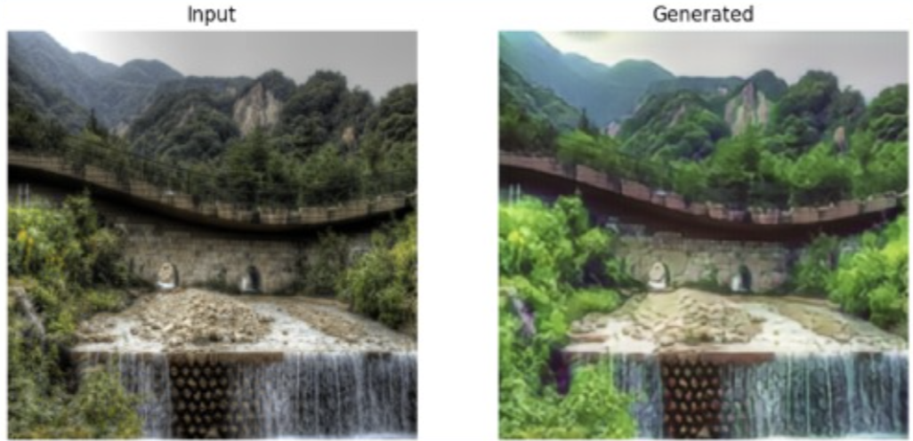
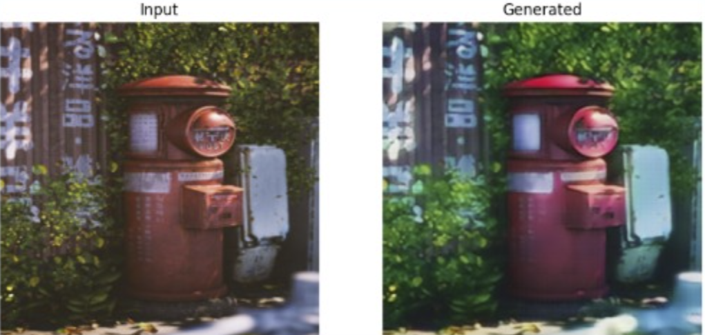
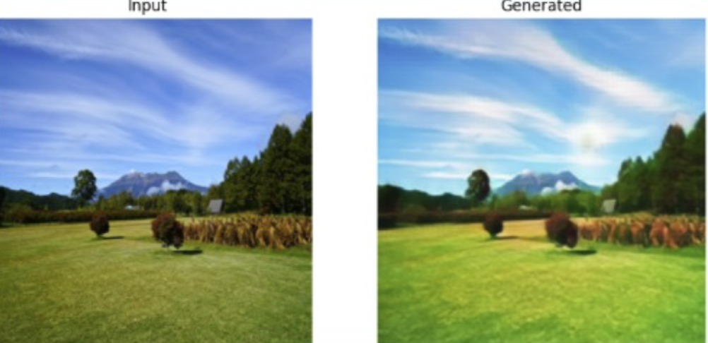
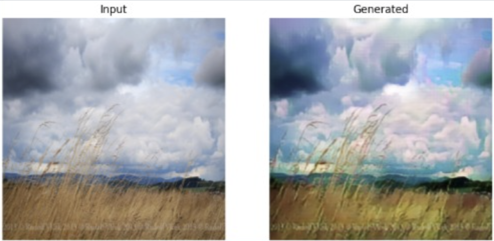

# CycleGAN Ghibli Style Transfer

A PyTorch implementation of CycleGAN for unpaired image-to-image translation between real-world photographs and Studio Ghibli-style artwork.

## Overview

This project uses CycleGAN to learn image-to-image translation between:

- Real photographs
- Ghibli-style images

without requiring paired training examples.

## Project Statistics

| Metric | Value |
|----------|----------|
| Model | CycleGAN |
| Framework | PyTorch |
| Dataset Size | 2500 images |
| Image Resolution | 128 × 128 |
| Batch Size | 1 |
| Epochs Trained | 25 |
| Optimizer | Adam |
| Environment | Google Colab GPU |
| Training Type | Unpaired Image-to-Image Translation |

## Technologies

- Python
- PyTorch
- Google Colab
- CycleGAN

## Training Details

- Dataset: ~2500 photos + ~2500 Ghibli images
- Resolution: 128×128
- Epochs: 25
- GPU: Tesla T4

## Project Structure

```text
cyclegan-ghibli-style-transfer/
├── README.md
├── ghibli_cyclegan.ipynb
├── requirements.txt
└── results/
    ├── waterfall_landscape.png
    ├── red_mailbox.png
    ├── mountain_field.png
    └── cloudy_grassland.png
```

## Results

After 25 epochs, the model learned Ghibli-inspired color palettes, lighting, and texture patterns while preserving the overall scene structure.

### Waterfall Landscape



### Red Mailbox



### Mountain Field



### Cloudy Grassland



## What I Learned

- Implemented CycleGAN architecture from scratch in PyTorch
- Built custom Dataset and DataLoader pipelines
- Implemented adversarial, cycle consistency, and identity losses
- Trained and resumed models using checkpoints
- Managed GPU training on Google Colab
- Evaluated image-to-image translation performance qualitatively

## Future Improvements

- Train on higher resolution images (256×256)
- Train for 100+ epochs
- Use mixed precision training
- Experiment with larger Generator architectures
- Add quantitative evaluation metrics

## Author

Svanik Soma
